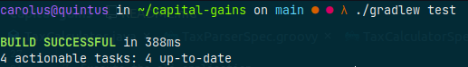
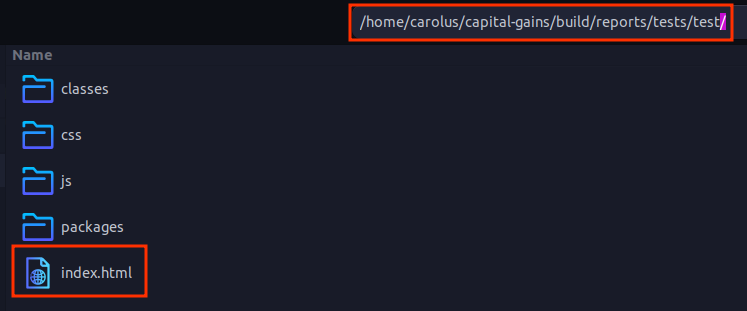
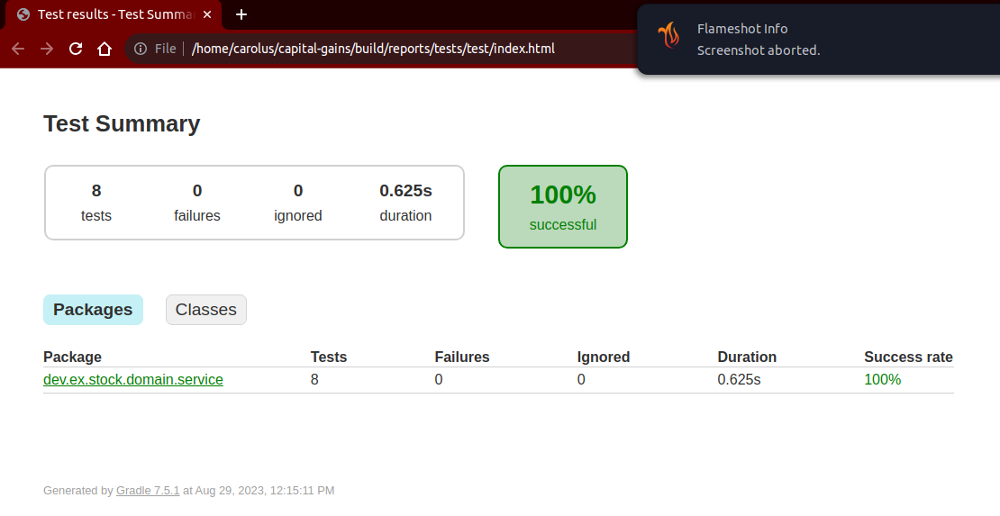
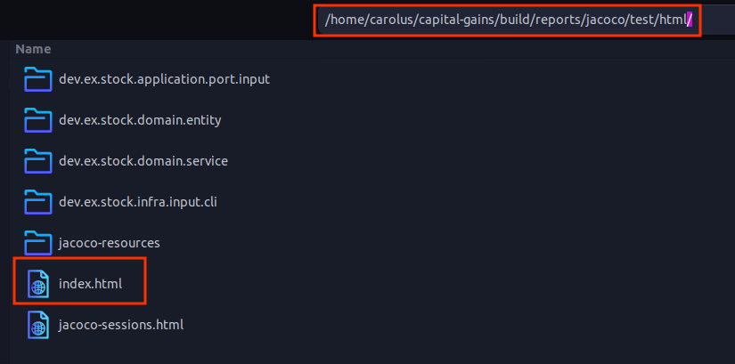
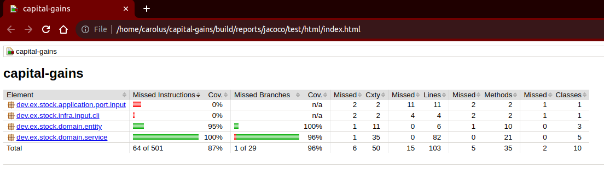

# capital-gains

## Technical & architectural decisions

One of the main ideas when starting this challenge was to keep business logic separated and isolated.\
Thats why I decided to use Hexagonal Architecture and Domain Driven Design.\

1. Infrastructure (Framework) hexagon:\
    Provides the outside world interface. For this challenge in particular is exposed through a cli interface (adapter).\
    If necessary we can add output adapters (DB, cache, file) or add/replace input adapters (gRPC, REST, SOAP).
2. Application hexagon:\
    It is where business rules are processed and orchestrated, serving as a middleman to work between Infrastructure and Domain hexagon.
3. Domain hexagon:\
    We define the value objects (immutable) and entities (not used for this challenge) for describing the capital gains problems.\
    For the service package in particular is where business logic is applied.\
    And for this challenge I decided to apply Pipes and Filters pattern to process json input into different sequences to process every ouput, from previous step.

## Libraries & frameworks used

In order to achieve challenge expected goals:

1. Libraries:\
    `jackson`: To serialize and deserialize input and outputs from cli application.\
    `vavr`: To manage exception handling through `Try.of()` in order to write simple code.
2. Frameworks:\
    `spock`: To test code and ease coverage.

## Instructions to compile & run

Open your Terminal and follow next steps.
1. Download SDKMan.
```shell
curl -s "https://get.sdkman.io" | bash
```


2. Install java jdk 17.
```shell
sdk install java 17.0.8-zulu
```


3. Install Gradle.
```shell
sdk install gradle 7.6.1
```


4. Move to project location.
```shell
cd capital-gains
```


5. Clean & build `capital-gains` project.
```shell
gradle clean build
```
Or
```shell
./gradlew clean build
```


6. Give execute perms to `capital-gains` bash script for your user.
```shell
chmod u+x capital-gains
```


7. Execute the cli application.
```shell
./capital-gains < input3.txt
```


## Instruction to run test

This project uses `JaCoCo`(Java Code Coverage) plugin to generate html test reports.

1. Run and generate test reports.
```shell
./gradlew test
```


2. Go to and locate `index.html` files and open them in your browser.
    1. For Test Summary report go to.
    ```shell
   capital-gains/build/reports/tests/test/index.html
    ```
   
   

    2. For JaCoCo report go to.
    ```shell
   capital-gains/build/reports/jacoco/test/html/index.html
    ```
   
   
