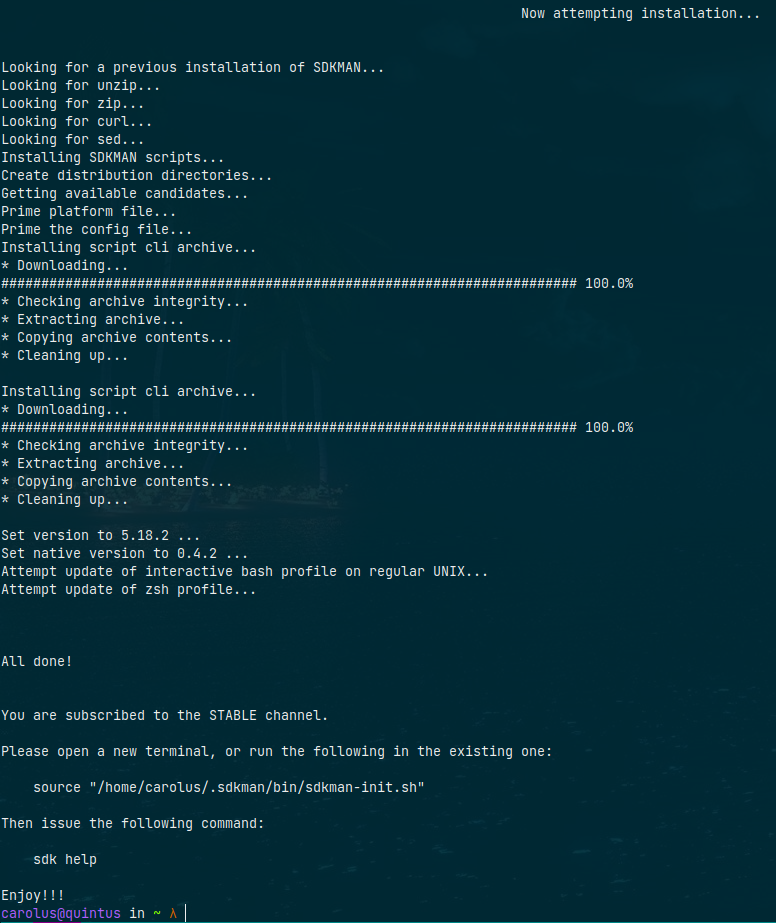
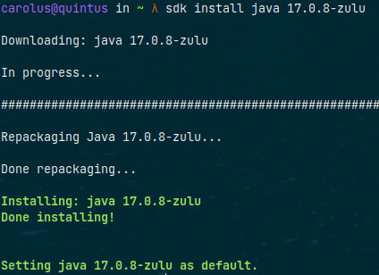
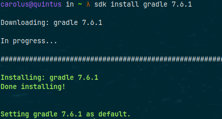
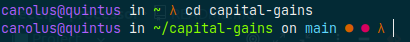
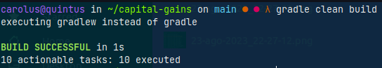
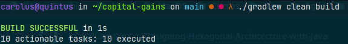
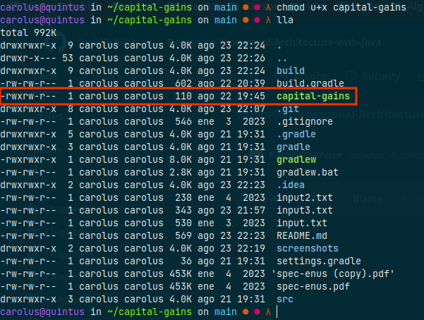
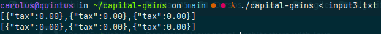

# capital-gains

## Instructions to compile & run

Open your Terminal and follow next steps.
1. Download SDKMan.
```shell
curl -s "https://get.sdkman.io" | bash
```


2. Install java jdk 17.
```shell
sdk install java 17.0.8-zulu
```


3. Install Gradle.
```shell
sdk install gradle 7.6.1
```


4. Move to project location.
```shell
cd capital-gains
```


5. Clean & build `capital-gains` project.
```shell
gradle clean build
```
Or
```shell
./gradlew clean build
```



6. Give execute perms to `capital-gains` bash script for your user.
```shell
chmod u+x capital-gains
```


7. Execute the cli application.
```shell
./capital-gains < input3.txt
```

